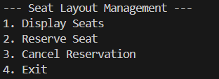
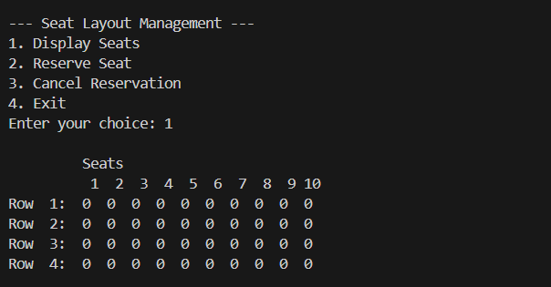
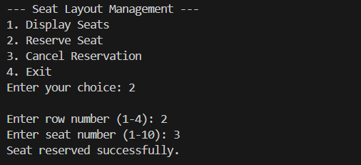
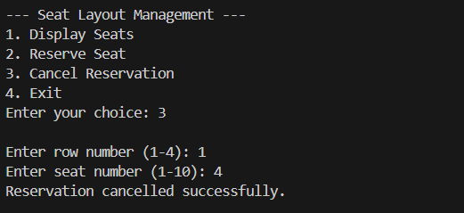
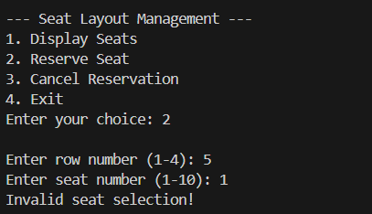
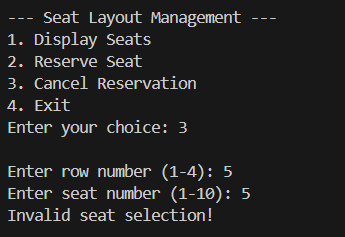

# Seat Layout Management System in C

## Overview
This project implements a simple Seat Layout Management System using the C programming language. It allows the user to view the current seating layout, reserve a seat, and cancel an existing reservation through a menu-driven console interface. [attached_file:file:10]

## Features
- Display the seat layout as a 4 × 10 grid.
- Reserve a specific seat by entering row and seat number.
- Cancel an existing reservation.
- Validate row and seat numbers to prevent invalid selections. [attached_file:file:10]

## Technologies Used
- Language: C
- Paradigm: Procedural programming
- Data structure: 2D integer array for seats [attached_file:file:10]

## Seat Representation
- The hall is modeled as a 2D array seats[ROWS][COLS].
- ROWS is defined as 4 and COLS as 10 using preprocessor macros.
- Each element represents a seat:
  - 0 – seat is free
  - 1 – seat is reserved [attached_file:file:10]

## Program Flow

### Main Menu
The main() function initializes all seats to 0 and repeatedly shows this menu:

1. Display Seats  
2. Reserve Seat  
3. Cancel Reservation  
4. Exit  

The user selects an option, and the program calls the corresponding function until option 4 is chosen. [attached_file:file:10]

### Display Seats
displaySeats(int seats[ROWS][COLS]) prints a header row with seat numbers 1–10 and then prints each row with its label and the current status (0 or 1) of every seat, giving a full view of the layout. [attached_file:file:10]

### Reserve Seat
reserveSeat(int seats[ROWS][COLS]):
- Prompts for row (1–4) and seat (1–10).
- Checks that the selected indices are in range.
- If the seat is already reserved (1), an error message is shown.
- Otherwise, it sets the value to 1 and prints a success message. [attached_file:file:10]

### Cancel Reservation
cancelReservation(int seats[ROWS][COLS]):
- Prompts for row and seat number.
- Validates that the indices are in range.
- If the seat is not reserved (0), it informs the user.
- Otherwise, it sets the value back to 0 and confirms the cancellation. [attached_file:file:10]

## Input Validation
Both reservation and cancellation operations:
- Reject rows outside 1–4 or seats outside 1–10.
- Print “Invalid seat selection!” and return to the menu without modifying the array, preventing crashes from bad input. [attached_file:file:10]

## How to Compile and Run

1. Save the source file as seat_allotment_management-1.c.
2. Compile with GCC or another C compiler:  
   gcc seat_allotment_management-1.c -o seat_layout
3. Run the program:  
   - Windows: seat_layout.exe  
   - Linux/macOS: ./seat_layout [attached_file:file:10]

## Screenshots

- Main menu  
  

- Initial seat layout  
  

- Successful reservation  
  

- Successful cancellation  
  

- Invalid reservation attempt  
  

- Invalid cancellation attempt  
  

  ## Author

  Vyshnavi
  ITP Project
  SAI University, Chennai
